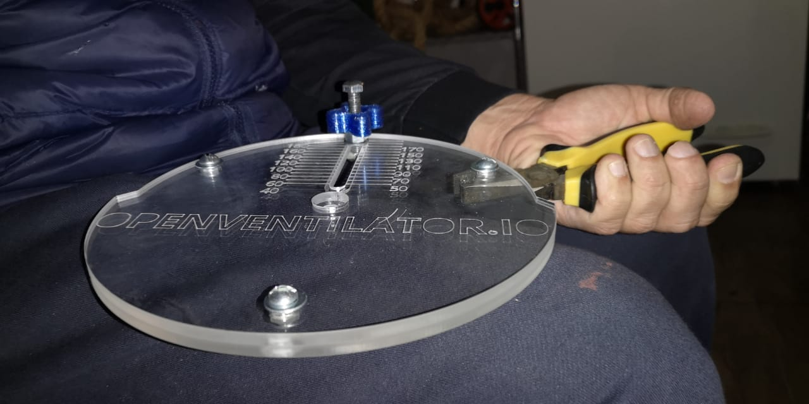

**Motor Assembly**

Start by inserting the washer into the shaft. This washer is responsible by holding the CrankWheel and don't allow it to slip on the shaft movement.

Also notice that the Washer don't allow to touch the back part of the motor and keeps a distance from it

Check if the holes to fix the motor on the frame are in the correct position, you can use a marker or a sharpie to mark the holes and drill it with a Driller. Be sure to be gentile as the Acrylic can crack with over pressure and also to use the exact SCREW DIAMETER on the BIT diamenter

Now you can assembly the 2 CrankDisks Wheels, they have differant characteristics, but the important thing to notice is that the screw head goes on the side that have the ruler with the numbers. 

Align the center to be exatcly co-centric

After that you can use the correct tools to tight the screw and fix the 2 disks

If your motor shaft is not long enough to clear the the bolt, you can either use countersunk bolts or use the 3D printed Motor shaft adapter.stl

The sources of this part are here, in case you want to adjust it:
https://cad.onshape.com/documents/a7ff1fc9204fe3313dfe2b3a/w/b15e7fb4bb236fa3be8ddf97/e/5ff156e08413e785d0c10ea7 

Finally remember for when you install the electrical part: **only run the motor in its forward direction**. Windscreen wiper motors are not designed to run in reverse and will wear out quickly if you do.
