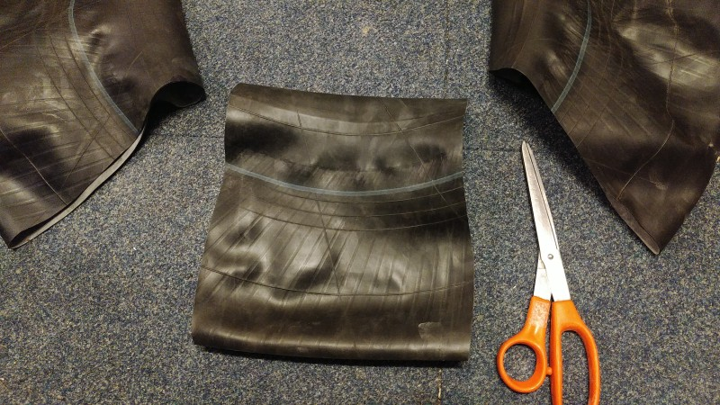
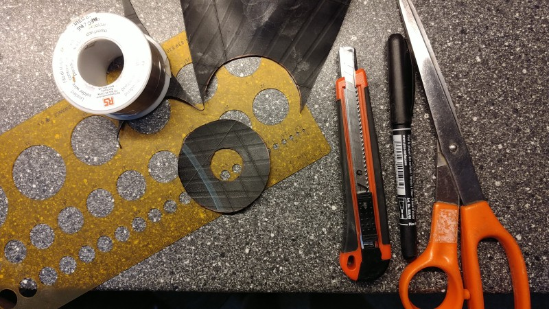
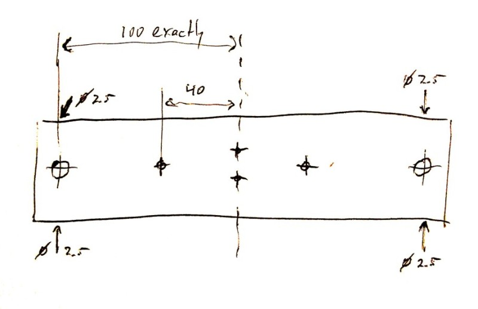
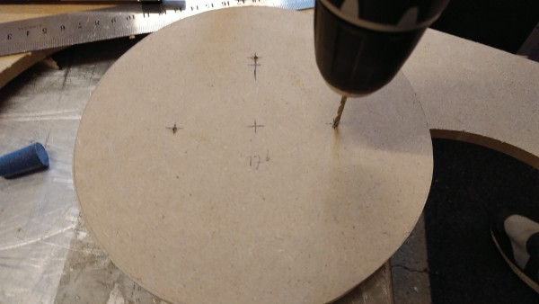
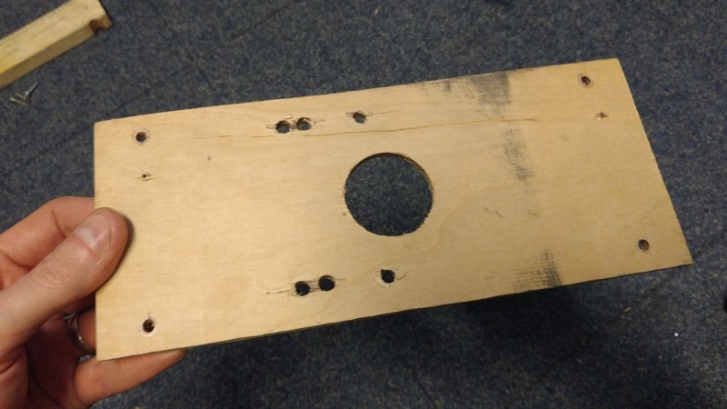
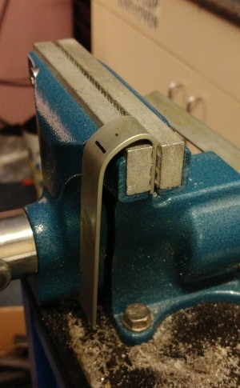
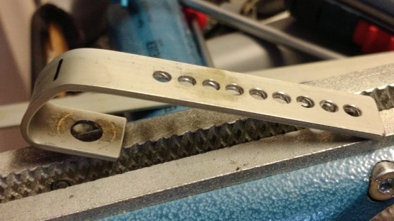
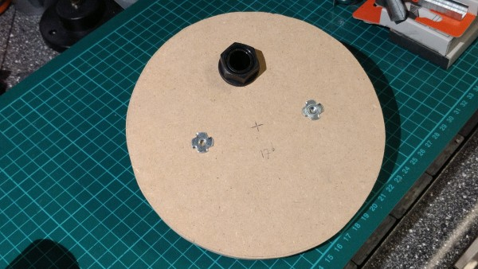
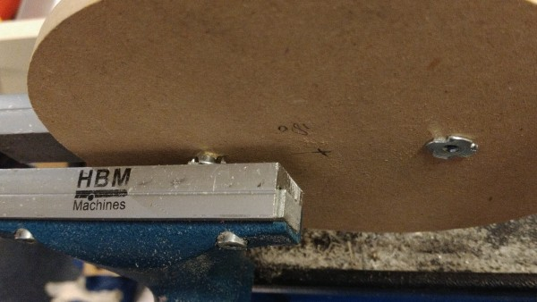

 **OPEN VENTILATOR**

# Wooden bellows mechanism with windscreen wiper motor

2020-05-11

This pump device uses only material from a DIY shop plus a truck inner tyre.

It does not give a phase signal (such as present in the Spartan model), indicating whether the device is in the inspiration or expiration phase. This should switch every 180 degrees, and it can be used to create two motor speeds. If you know a good and simple way to add it, let us know.

# Required materials

- 0.6 m Wooden beam of 20x40 mm up to 25x50 mm

- A piece of roughly 6 mm thick MDF. Not too thick or the motor doesn't fit. Not too thin or it doesn't clamp well. 

- 1 m Aluminium, copper or steel rods or tubes of around 10 mm. Slightly different size will also work. Make sure to have a drill for this size.

- 0.2 m PVC tube with INSIDE diameter 1 mm larger than the rod/tube above. Make sure you have a drill that can drill exactly this size. Aluminium, copper or steel tubes cannot be used, it will jam.

- Truck inner tire of R13 to R15 (that's 20 to 23 cm flat). (R16 requires more distance between the rods).

Materials known to fail are rain coat trousers and swimming caps. Don't use these.

- 8x Wood screws 20x4 mm (or if thicker beam selected 25x4 mm). Make sure to have a drill that fits the core part, e.g. 2.5 mm. Countersink screws are often possible but not everywhere.

- 4x Wood screws 12x4 or 15x4 mm. Make sure to have a drill that fits the core part, e.g. 2.5 mm.

- 4x Carriage bolt M4 or M5, 40 to 50 mm long with fitting nut; OR alternatively 4x weft nut (M4 preferred) and 4x 35 mm fitting bolt.

- A plastic hosetail (fitting your hose size) with a thread diameter of less than 22 mm (13/16"?). It may be an angled hosetail, depending on how you want to place the bellows.

- Plastic nut for the hosetail

- 4x 90 to 120mm 5mm wood screw, to function as stands/feet. Making a stand can be done in different ways too.

- roughly 1/3 meter of 15 to 25 mm wide steel strip, 2 to 3 mm thick, for motor crank and connecting rod.

- 2x eye screw (a screw with a ring at the end) with a eye diameter of between 6 and 10 mm.

- An M6 bolt or M8 bolt of 30mm or longer, fitting through the eye screw selected above.

- 2x M6 or M8 nuts fitting above bolt (or 1x lock nut)

- An M4x10 bolt (M5 also possible)

- An M4 nut (fitting above bolt)

# Required tools

- Wood saw

- Drill press, this is a drill in a stand that can drill straight down. The straight angle is important to prevent jamming.

- Drill bits of specific sizes, see materials part specially for large drills.

- Manual jigsaw or machine jigsaw, to cut large circular disks.

- Hole saw of 22 mm and 38 or 40 mm

- Metal saw

- Screw drivers

# Build procedure

## 1. Bellows

Time: 0:03 to 0:15

The bellows material should withstand many movements and not let air though. Rubber will work. Not working:
- Rain coat starts to leak after a week of constant use. 
- Swimming cap is too flexible and breaks too easily.

The length of the bellows is dependent on the diameter of the tyre according to the following table:

| Tyre diameter | Effective bellows length | Length of rubber to cut | Notes
|---------------|--------------------------|-------------------------|-----------------------------------
| R13           | 190                      | 250                     | Length cannot be used completely
| R14           | 160                      | 220                     |
| R15           | 140                      | 200                     |
| R16           | 125                      | 185                     | Requires a wider frame

We also need an O ring to seal the hosetail. On a piece of rubber, draw a circle of between 45 and 55 mm diameter and cut it with a pair of scissors. On this circle, draw a circle of 22 mm and cut it out with a sharp knife.

## 2. Wood beam pieces

Time: 0:20 to 1:00

Make the following lengths: 2x beam of 240 mm, 4x block of 40 mm. Mark the middle of the beams.

While drilling the following holes, put the wood in a clamp in the drill press. Make sure to drill straight down. Drill the big holes as accurately as possible. Pre-drilling with 5mm might help, depends on your drill.

For quick drilling, you may use an end stop at 20mm in the vice, but if you do, remember that the distance between the big holes is more important than the distance to the ends.

The first 240 mm beam is the ***end beam***. On this beam, make 2 big holes of the inner tube/rod diameter (e.g. 10 mm). The distance should be **exactly 200 mm** between them (so roughly 20mm from the ends).

Rotate the beam 90 degrees, make a hole of 2.5mm (screw core diameter) at the same distance from the ends. Rotate 180 degrees and drill another hole. Do the same on the other end. So drill 4 holes.

The second 240 mm beam is the ***slider beam***. On this beam, do the same, but make the big holes fit the (slightly bigger) PVC tube (e.g. 13 mm). Also drill the same 2.5 mm holes.

On the slider beam also 2 holes for the screw eyes need to be made. Drill these with the core diameter of the screw eye (e.g. 2 mm). Make the holes 10 mm above each other in the middle of the beam (see picture).

On both beams, drill two holes at 40 mm from the center, so 80 mm apart. These are to mount the disks. The diameter needed is the carriage bolt diameter (or the inner diameter of the weft but, if you use those).

On all 40 mm blocks, do something similar again. The inner (e.g. 10mm) tube/rod should fit here. Also drill two 2.5 mm holes in each block.

## 3. Disks

Time: 0:20 to 1:00

Draw circles on the roughly 6 mm MDF. While doing this, **mark the center** (we'll need it later). Use a diameter for the circles of the tyre diameter + 25 and + 30 mm. Make 2 of each, according to this table. 

| Tyre diameter | Small diameter disks | Large diameter disks | Notes
|---------------|----------------------|----------------------|-----------------------------------
| R13           | 155                  | 160                  |
| R14           | 165                  | 170                  |
| R15           | 175                  | 180                  |
| R16           | 185                  | 190                  | Requires a wider frame

So now you have 4 disks.

On all disks, indicate 2 points on a line, both at 40 mm from the center (see picture below). On the indicated points, drill two holes of the carriage bolt (or weft nut) diameter. For accuracy, it's best to first drill a small hole of 2.5 mm.

We also need 1 hole in 1 disk for the hosetail. This should be in one of the small diameter disks.  The hole needs to be 45 mm away from the center, at 90 degrees from both existing holes (forming a T-shape). Drill a 2.5 mm hole there, and next saw a 22 mm hole in that.

Finally we need a hole in the larger diameter disk to let the hosetail through. Also there the hole needs to be 45 mm away from the center. Drill a 2.5 mm hole there, and next saw a 38 mm hole in that.

## 4. Motor board

Time: 0:05 to 1:00

Find out what motor mount pattern you need. There are some patterns in the directory with windscreen wiper motor documentation. The motor should be placed such that the heaviest part is in the middle of the bellows system, probably pointing towards the bellows. This may mean you have to rotate the pattern to accomplish this.

Saw/create a board of MDF or multilayer wood, size 240x100 mm.

Drill holes to mount the board onto the 40 mm blocks that will go onto the 10 mm tube/rod. These holes have to be at the corners, as in below picture. It is important that the distance between them is **200 mm exactly**. In the other direction, fit the distance from the ends so that things fit nicely onto the 40 mm blocks, this is less critical. For a 20 mm thickness beam, this would mean 10 mm distance from the edge. Make the holes 1 to 1.5 mm larger than needed, so the screw can be moved in the hole, to make things fit well. Don’t use countersink screws here for this reason.

Hole-saw the motor axis hole in the center of the board. Drill other holes according to the required pattern for your motor. Mount the motor once (to verify the fit), and then unmount the motor again. It is inconvenient to have it on the board during the assembly.

## 5. Slider rods/tubes

Time: 0:02 to 0:05

Saw the aluminium or steel 10mm rod or tube into 2 lengths of 500 mm.

Saw the fitting PVC tube (that fits over the rod/tube) into 2 lengths of 100 mm.

## 6. Motor crank and connecting rod

Time: 0:15 to 1:00

If your motor already has a crank, you may use that instead. You may need to remove a ball joint. We need to be able to select various crank lengths, to select the air displacement volume. This has to be adjusted to the patient.

### Crank

Saw/create a piece of steel strip of 120mm length.

Drill a hole in it, the size of the axis (often 8 mm, but depends on the motor), at 10 mm from the end.

Drill a partial hole in this hole, to accommodate the cone with splines in the motor axis. This could for example be done by drilling 1 mm deep with a 10.5 mm drill. If the top of the spline is 11 mm (over the teeth), take 10.5 mm. Try it on the motor.

The strip now has to be bent. Mark a line at 20 mm from the end (with the hole), and one 40 mm from the end. Between these 2 lines the bend needs to come. Clamp the strip in the vice until the first line, with the spline-side away from you. Bend the strip 180 degrees in your direction, and try limit the bend to the 20 mm between the lines. Try to make the end result such, that the two lines are above each other.

If you are happy with the bends, it is time to make multiple holes at the other end. Mark center cole points, and put 2mm between the holes. Remember the center-to-center distance for later. Do this on the available space on the strip. After the holes are marked, drill them. For an M4 bolt, drill 4mm holes. Clean the edges of the holes with a countersink, or - if not available - by manually rotating a large drill through the holes.

### Connecting rod

Saw/create a piece of steel strip of 240 mm length.

Drill a hole to fit the bolt that will go through the screw eye. M6 or M8, so 6 or 8 mm, depending on your screw eye selection. Put it at 10 mm from the end.

Mark a set of hole center points at the other end. Use the same center-to-center distance as with the crank, and use the same drill size. Make at least the same amount of holes as for the crank. Drill these holes. Clean the edges of the holes with a countersink, or - if not available - by manually rotating a large drill through the holes.

## 6. Assembly

Time: 0:30 to 2:00

Put the 2 PVC tubes through the slider beam (the beam with the large diameter holes). Put wood screws in the 2.5 mm hole, and do the following to fix the PVC tube correctly: Look through the tube, with light below it, while turning in the screw. When you see a dent appearing on the inside of the tube, you can twist it a quarter turn more, then stop tightening it further. Don't use electric tools to do the tightening, they are too fast, and the screws will punch through the PVC.

Put the created rubber O-ring on the hosetail's thread and put the hosetail in the disk with the 22 mm hole. Secure it with the plastic nut.

Put the 4 carriage bolts through the 2 small diameter disks and hammer their square parts into the wood (support the wood near the hole while doing this). Or if you are using weft nuts, clamp them in with a vice, see picture.

Put the rubber bellows over the first small diameter disks without the hosetail. Leave some 10 to 15 mm over the edge of the disk. It should not overlap with the O-ring, or it will not seal well. 

Add the large diameter disk over it, add the slider beam, and screw this together with the (carriage) bolts. Make sure the bellows is enclosed well between the disks.

Put the second small diameter disk with hosetail into the bellows with 10 to 15 mm over the edge. Rotate the disk such that the small holes are aligned with the ones on the other disks.

Add the large diameter disk over it, add the end beam, and screw this together with the (carriage) bolts. Make sure the bellows is enclosed well between the disks.

#### Onto the rods

Put the long 10 mm rods/tubes through the plastic tubes in the slider beam and the 10 mm holes in the end beam. Put wood screws in the 2.5 mm hole, and tighten them carefully. You can feel when it becomes tight. Don't use electric tools to do the tightening, you have to feel it. Don't use a lot of force, when the beam cannot slide over the rod any more it is good. Use some force to check if the beam really cannot move any more.

Put the small 40 mm blocks onto the 10mm tubes/rods. Put the clamping screws in, but don’t tighten them yet. Put the motor board onto it these blocks. Put 4 screws through the board into the blocks.

#### Add motor

Solder wires to the motor. If you have no mating connector, you can solder on the contacts (this may involve breaking the connector edge open).

Mount the motor onto the motor board.

Mount the crank onto the motor. Put the nut on and tighten it.

Put the M4x10 bolt (or other selected size) through one of the middle holes in the connecting rod. Put a nut on the other end and tighten it a bit.

Put the screw eyes into the slider beam. Put the connecting rod between the motor’s crank and the screw eyes. Put the M6 or M8 bolt through the eye screws. There is probably a lot of space, optionally you can insert a bigger nut to serve as spacer. Put the 2 fitting nuts on the other end. Tighten the nuts against each other, not against the screw eye. Alternatively, use a single lock nut.

#### Alignment

Rotate the motor shaft (by hand or with a very low voltage) to the top position, where the bellows will be inflated maximally. Choose the hole in the crank that is furthest from the center. Put the M4 bolt of the connecting rod in the selected hole.

Shift the motor board with the 40 mm blocks to the highest position, so the bellows is maximally inflated. Measure that the distance from the end to the top of the sliding is the same on both sides (as indicated in the picture above). When well adjusted, tighten the screws of the 40 mm blocks.

Move the crank manually or with low motor voltage to the other side to check if the bellows can be compressed this far. If not, choose a crank hole nearer to the center, and put a piece of tape over the hole that cannot be used.

Add 4 long wood screws as stands/feet on all corners, see picture. As the hole might have a too small diameter for the core of this screw, don’t screw it in very far. Alternatively, you could make your own stand.

### Note about adjusting the crank

If you have adjusted the crank, you may also need to adjust the connecting rod. The reason is that the bellows works best if inflated maximally. At lower inflation, the air volume is very variable and dependent on other factors. When inflated maximally, the amount of moved air is most constant.

