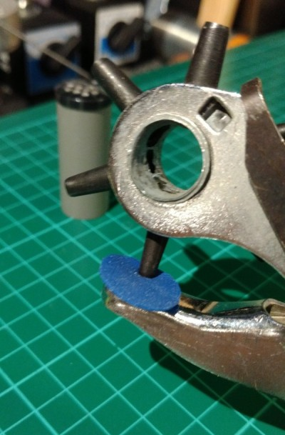

 **OPEN VENTILATOR**

# Required material

- PLA or better PETG printing filament
- Silicon sheet of between 0.25 and 1 mm thickness. Material from a silicon swimming cap, silicon oven glove or silicon protection pad is also fine. A piece of bicycle inner tyre might even work.
- 14x M3x20 or 4-48x3/4" countersunk bolt
- 14x M3 or 4-48-fitting washer
- 14x M3 or 4-48x3/4" nut

# Required tools

- 3D printer
- Knife
- Screwdriver fitting the bolts
- Small wrench or pliers for the M3 nuts
- Metal file

# Instructions to make the printed valve block

To make the part, we first need to make sure your printer can actually print the part well. For that we use a test piece, which is small and relatively quick to print. Set the print settings below and print `leak test.stl`. The used dimension units are mm.

## Print settings

#### Layers and perimeters

```
Vertical shells - Perimeters: 3
Horizontal shells - Solid layers:   Top: 5   Bottom: 3
Quality - Extra perimeters if needed: check
```

#### Infill

```
Fill density: 10%
Fill pattern: Triangular (or rectilinear if not available)
Top/bottom fill pattern: Concentric (gives least leaks)
```

## Test the test piece

After you have printed the test piece, we have to check it seals well. Put some drops of soapy water in the piece, shake it around so the water gets everywhere and then blow on its tube. There should be no bubbles coming out. If your piece is not sealed, try to increase your print extrusion density. This should be done with small steps of a few percent only. Find information about this on the internet about your printer and slicer program. After you have adjusted the settings, reprint the test piece until it seals well. 

Note that the test piece is more sensitive to leakage on the edge between the hosetail and the block than the actual valve block. The sensitivity of leaks through the horizontal and vertical perimeters is similar.

## Print the real parts

After you have checked that you can print a sealed part well, you can print the real valve block. We will of course use the same print settings. 

There are multiple STL files available for different hose tail sizes. Select the one that fits your hose inside diameter. For that diameter, print a top part and a bottom part. The top part is quickest to print (a couple of hours). The bottom part takes about 2x to 3x that time.

The bottom parts needs a little smoothing with a normal metal file. Don't use a narrow file, a normal width file makes sure the surface is smooth and flat. File the ridges of the bottom piece slightly such that the ridges don't have unevenness anymore, and are the same height everywhere. 

## Cut the membrane

It is easiest to have the membrane be laser cut with the supplied DXF file. However, you can also do it manually. For this, print the thin membrane STL. You need only 2 layers thickness, you can limit the print in your slicer program, but since it is 0.5 mm it might already be only 2 layers. 

Take a thin pen with water resistant ink. Draw through the curves of the membrane, and mark the holes precisely. 

The holes need to be punched. This can be done by hitting a sharp hollow object of the needed diameter with a hammer, or with leather belts hole pliers (see picture).



The curves need to be cut with a sharp knife. Because the material is flexible, cut the curves a small piece at a time and don't take the knife out. The material needs to be pressed down while cutting. It's therefore best to hold your thumb just behind the knife and then carefully move the knife away from your thumb a few millimeter each time. Replace your thumb just behind the knife after every partial cut.

The cut should be one continuous cut. Every side cut that you make, will create a possible place for the material to tear. If you _do_ make a side cut, currect it such that there is no sharp corner left in the material. This prevents tearing.

## Assembly
Put the bolts in the bottom part, from the bottom side up. Put the bottom piece flat on the table with the bolts sticking upwards. Place the membrane over the bolts. Put the top piece on top of this. Place the washers and the nuts over the screws and initially only put them on the bolt. This allows for easy handling. After all bolts have a washer and nut, tighten them only mildly. **DO NOT TIGHTEN THE BOLTS HEAVILY.** The block does not need very tight bolts, because it has patterns on the bottom side that concentrates the pressure where it is needed.


