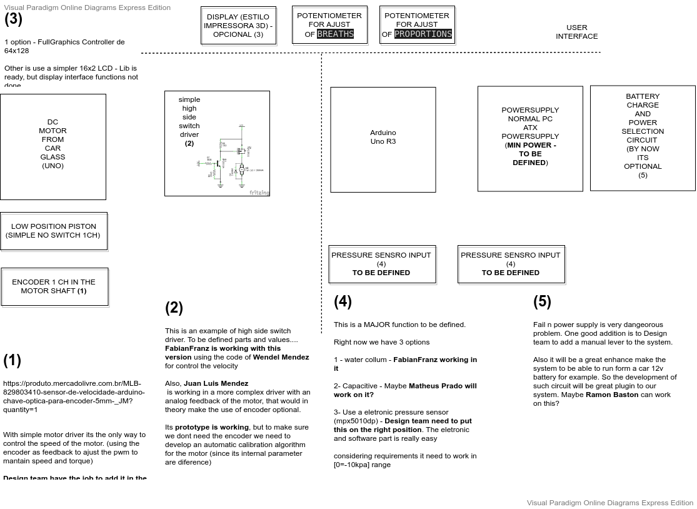

# OpenVentilator

> Welcome to the OpenVentilator project. This is an OpenSource Ventilator / Mechanical Respirator for the Covid-19 Crisis.

This initiative as well as [OpenLung](https://gitlab.com/open-source-ventilator/OpenLung) was born on the [Open Source COVID19 Medical Supplies](https://web.facebook.com/groups/opensourcecovid19medicalsupplies/) Facebook Group by the awareness of the need to create a Ventilator solution for the scarcity plaguing our society worldwide. I contacted Jeremias Almada from Argentina who by that time had presented an Ambu solution and a Cad Design. The idea was interesting but needed improvements.

Since then we tried to establish some development and community standards and evolved the project several times.

# :heavy_exclamation_mark::heavy_exclamation_mark:DISCLAIMER 
**PROJECT STATUS:** We still need validation with health regulatory institutions and compliance with clinical requirements.

**PLEASE DO NOT USE ONLY TIRE-CHAMBER**, ENCASE THE the inner part of the TireChamber with a foodbag like ZIPLOCK or any material with compliance to contact with food.

:warning: WE DO NOT YET GUARANTEE THE OPERATION OF THIS MACHINE | THIS MACHINE IS FOR EMERGENCY and HEALTH SYSTEM COLLAPSE SCENARIOS

## Main Goal

Design, Build, Validate and Supply a reliable Ventilation Medical Equipment for people/regions/countries in difficult economical situations with a component- and mechanical-agnostic philosophy. (This is why we didn't continue putting efforts into the projects being developed by other teams, who have a different society and economic reality)

**The equipment must have as few industrial parts as possible. If necessary, industrial parts must be easily accessible, even in small towns and villages.**

The equipment should be built independent of the main motor or the ventilation tool (AmbuBag, Bellows etc) to increase modularity of the parts and resources.

The equipment can be built with as few tools as possible, and even with the use of scrap to facilitate access to materials. 

The technical features are still being decided, the ventilator has not been validated yet.

### Technical & Medical Requirments (MVP)

|       Specification         |      Spartan model      |      Mark II                 |
|-----------------------------|:-----------------------:|-----------------------------:|
|Volume control               |Mechanical native feature|Mechanical control            |
|Ventilation frequency        |Implementing 2 types     |Electronic native control     |
|Inhale/Exhale proportion     |Implementing 2 types     |Electronic native control     |
|Inhale Pressure Sensing      |    Not Available        |Electronic sensor             |
|Exhale Pressure Sensor       |    Not Available        |Electronic sensor             |
|Flow Sensor                  |    Not Available        |Electronic if available       |
|Inlet air filtration         | HEPA(recommended)       |Mandatory HEPA                |
|Inlet air humidifier         | HME Filter(recommended) |Humidity and Moistue Exchanger|
|Exhaust filtration           | Optional(recommended)   |Mandatory                     |
|Peep Pressure regulator      | Vynil hose solution     |Vynil hose solution           |
|Peep Pressure indicator      | Water column indicator  |Digital UI or WaterColumn     |
|Oximeter                     | Not available           |Electronic sensor             |   
|Heartbeat sensor             | Not available           |Electronic Sensor             |

## Risk Control
- Inalhation speed 1s
- Exalhation speed 1 ~ 6 s
- From 10 to 35 cycles a minute
- PEEP Valve control between 1mm/h20 ~ 40mm/h20
- Mechanical Volumetric Ventilation Adjustment
- Contagion reduction by contaminated air
- [Brazil Sanitary Regulations](http://www.in.gov.br/en/web/dou/-/resolucao-rdc-n-356-de-23-de-marco-de-2020-249317437?fbclid=IwAR3tQyhVUPMqrTcX5HAW9Tq7MfYLCYCk8IwH2yqnO6RuaKEyzOCC9ImPHMI)

## Success Criteria

Validated Prototype (Looking for partners for testing on Lung Simulators)

## Current Status

	
	
	

## Modules 

- **Electronic Controller** Status `Testing`
- **Mechanical Motor** Status `Implementing`
- **Ventilator** Status:  `Validation`
- **Humidifier**  Status:  `Design`
- **Filtering** Status `Implementing`
- **Peep Valve** Status:  `Adopted` - Thanks to [ProjectOpenAir](https://www.youtube.com/watch?v=HEfCRcew_pk)
- **Breathing tube** Status:  `Testing`
​

### [Research we based on](https://github.com/popsolutions/openventilator/tree/folder-structure/00_Documentation/Research)

### For more information: https://www.popsolutions.co/openventilator

## If do you want to help

[First, ** CLICK HERE ** to complete the form please, so we can organize everybody](https://forms.gle/1h19khkxExsEmvPE6) 

Then join the WhatsApp group and talk with Amanda (+55 11 99735-5042 ): https://chat.whatsapp.com/HRMx9xzVdt8Gpmwgm7ZVZ3

### Slack Channel for work-in-progress discussions...

**Documentation, Hardware, Design and Code discussions** This was deprecated to avoid outsiders looking for profit 
[**Check the decisions ALREADY MADE**](https://openventilator-c-19.slack.com/archives/C010KFG8MUP)

### If I have seen further it is by standing on the shoulders of Giants.

Special thanks to:
 - [Jeremias Almada](https://www.linkedin.com/in/almada-jerem%C3%ADas-43888680)
 - Fabian Franz
 - [Jose Ignácio Méndez](https://www.linkedin.com/in/jos%C3%A9-ignacio-m%C3%A9ndez-0ba3ab53/)
 - [Washington Perez](https://www.linkedin.com/in/washingtonperez/) 
 - [Jaqueline Passos](https://www.linkedin.com/in/jaquelinepassos/)
 - [Amanda Pellini](https://www.linkedin.com/in/amanda-cristina-maciel-pellini-9177226a/)
 - [Marguel Gutierrez](https://www.linkedin.com/in/marguelgtz/)
 - [Henrique Aguilar](https://www.linkedin.com/in/henriaguilar/)
 - [Vandeir Soares](https://www.facebook.com/vandeir.soares.7)
 - [Fábio Soares]
 - [GlobaltTech]
 - [Ronaldo Alves](https://www.linkedin.com/in/ronaldoalves10/)
 - [Ethan Moses](https://www.cameradactyl.com/)
 - [Wendell Mendes](https://www.linkedin.com/in/1endell)
 - [Rodrigo Borges](http://linkedin.com/in/rborges111)
 - [Henrique Nery](https://www.linkedin.com/in/henrique-nery-650216a2/) 
 - [Duit](https://www.duit.com.br/)
 - [Carlos Delfino](https://github.com/CarlosDelfino)
 - [Marcio Dultra](https://www.linkedin.com/in/marciodultra)
 - [Três meninas hardware store](https://www.google.com/maps/place/Casa+das+3+Meninas/@-23.5391312,-46.6524764,19.5z/data=!4m5!3m4!1s0x0:0x377232460c40d90d!8m2!3d-23.5391706!4d-46.6524278)
 - [The MIT guys from this paper](https://web.mit.edu/2.75/projects/DMD_2010_Al_Husseini.pdf): Abdul Mohsen Al Husseini, Heon Ju Lee, Justin Negrete, Stephen Powelson, Amelia Servil, Alexander Slocum, Jussi Saukkonen. 

All our families, wives and husbands that for the last days have been supporting us on our craziness.

All the doctors, nurses and paramedics in the field fighting this common enemy.