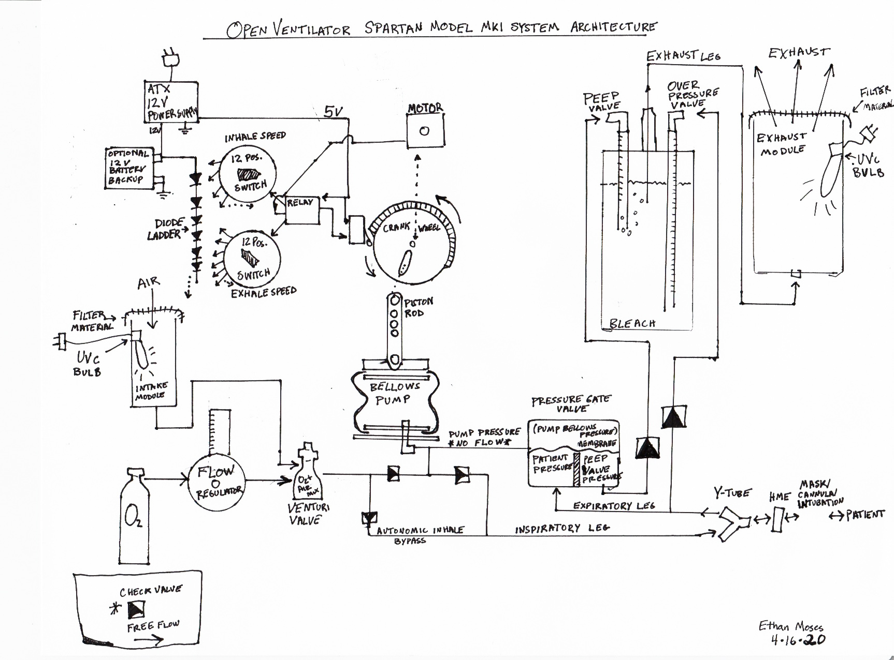

 **OPEN VENTILATOR - System description**

# Sytem description

This document describes the system at top level. From here you can dive lower into various parts.

## Block diagram

The system as a whole consists of the following sections.

Each of these sections corresponds to a directory on git. Note that in the Spartan model, the electronics is very limited, and does not allow for monitoring. This will be improved in the Mk2 model.

Because OpenVentilator does not want to rely on only one way of creating a working system, therer are alternatives for most parts. Some ways are rather primitive, some are more high tech. The focus is on one standard construction, and the resulting design is called the Spartan model. The [Spartan model documentation](OpenVentilator.io_Spartan_Model_Documentation.pdf) describes how to build this standard model. It is built with the following manufacturing methods:
- Many laser cut acrylic parts
- Some 3D printed parts (possible to make them in a different way)
- Primitive electronics (no microcontroller, no IC's)
- Gluing PVC waste water pipes
- Simple tool operations such as cutting, sanding/grinding and screwing.

The system fulfils the requirements as stated on the [README file](README.md).

## Functional diagram

In more detail, the system looks like this.

The [Spartan model documentation](OpenVentilator.io_Spartan_Model_Documentation.pdf) describes how it works.

## Functional description

To be placed here.
